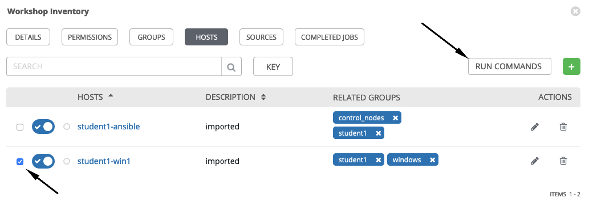
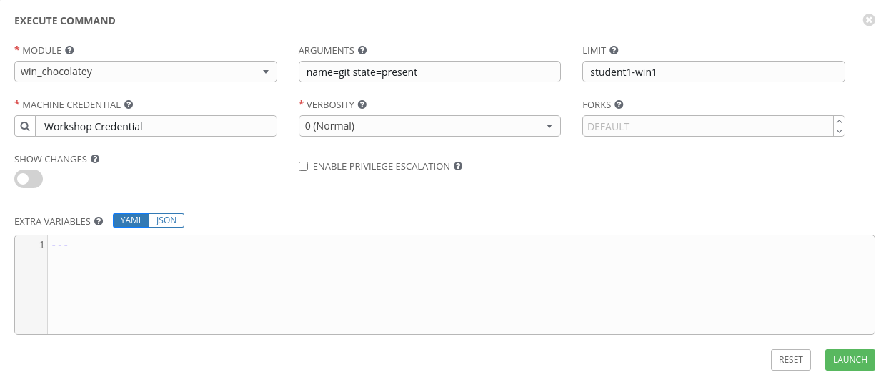
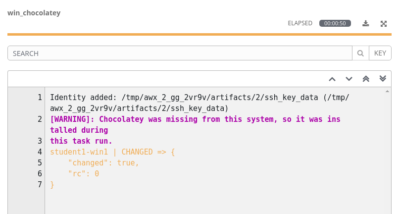
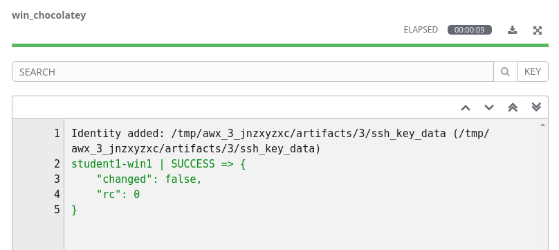
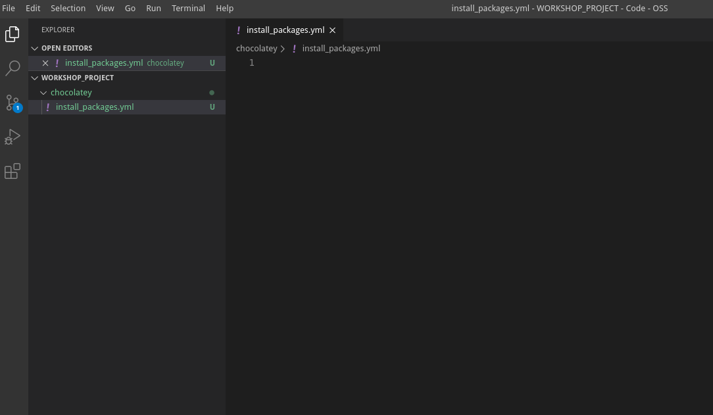
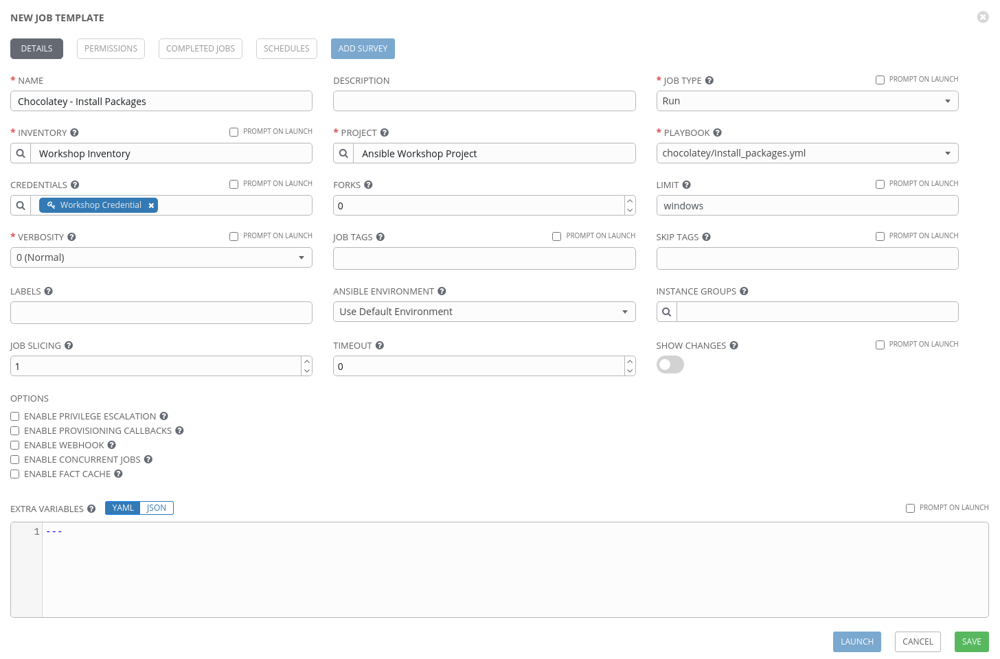
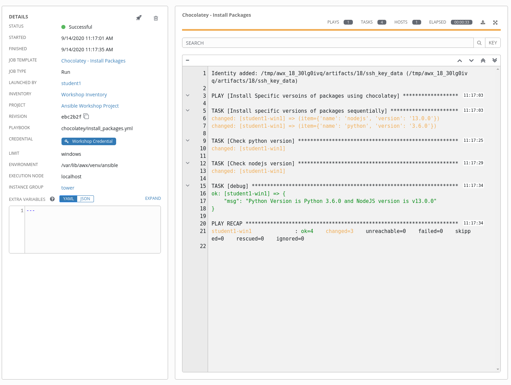
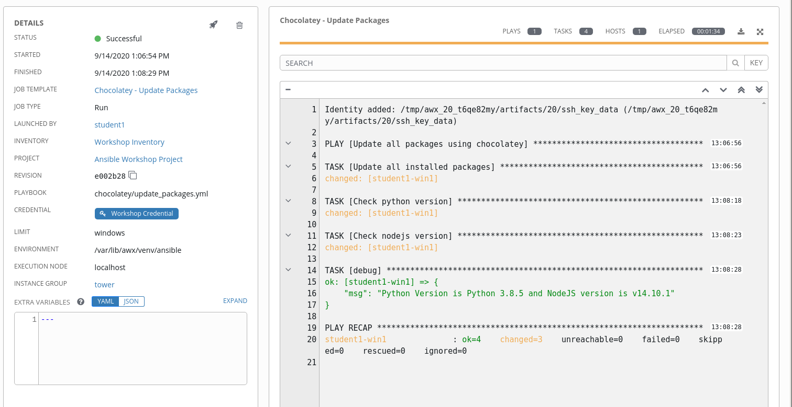

This exercise aims to introduce how Ansible makes it easy to control all aspects of managing Windows software using Chocolatey. We will cover Installing, updating and uninstalling packages, managing different sources, configuring chocolatey clients and other common tasks that a system administrator would take on. 

So what is Chocolatey anyways? Simply put, Chocolatey is a package manager for Windows. Chocolatey aims to simplify software management making it easier to automate your entire Windows software lifecycle.

*************************************************************************************************
**TODO:** ADD TEXT ON CHOCOLATEY CONFIGURATION SCENARIOS - SHOULD COME FROM THE CHOCOLATEY TEAM *
*************************************************************************************************

Section 1: The `win_chocolatey` module
=======================================================


## Step 1 - Install a package using an adhoc command


To start, we will use an adhoc comman to install `git` using the `win_chocolatey` module. The `win_chocolatey` module is used to manage packages on a Windows system using Chocolatey. 
<br>
To get started click **Inventories** on the left panel, and then click the name of our Inventory **Workshop Inventory**. Now that you are on the Inventory Details page, we will need to go select our Host. So click **HOSTS**.

Next to each host is a checkbox. Check the box next to each host you want to run an Ad-Hoc Command on. You will then see the **RUN COMMANDS** button become enabled. Click it now.



This will pop up the **Execute Command** window. From here is where we can run a single task against our hosts.

Fill out this form as follows:

| Key                | Value                    | Note                                                            |
|--------------------|--------------------------|-----------------------------------------------------------------|
| MODULE             | `win_chocolatey`         |                                                                 |
| ARGUMENTS          | `name=git state=present` | The name and state of the package                               |
| LIMIT              |                          | This will be pre-filled out for you with the hosts you selected |
| MACHINE CREDENTIAL | Workshop Credential      |                                                                 |



Once you click **LAUNCH** you will be redirected to the Job log. 


In the job output from the, you should see a result that looks like this:



We see that the output reports a CHANGED status to indicate that `git` was installed. The results also shows a warning that the Chocolatey client was missing from the system, so it was installed as a part of this task run. Future tasks that use the `win_chocolatey` module should now detect the client and use it without the need to install anything. to verify, re-run the job by clicking on the rocket icon in the **DETAILS** section, the output now should not have a warning, and will also not report any changes, but instead a SUCCESS status as the `win_chocolatey` module (like most Ansible modules) is idempotent (The run will also take less time because as the previous run installed 2 packages, this run installs none).



And just like that we have `git` installed. 


## Step 2 - Install multiple packages with specific versions

In the last step we installed one package in an ad-hoc fashion, however in reality it is more likely that we would want to include package installation as one step in a multi step play. It is also likely that we would want to install multiple packages (possibly even specific versions of said packages), In the exercise we will be doing just that.

Let's start by going back to Visual Studio Code. Under the *WORKSHOP_PROJECT* section Create a directory called **chocolatey** and a file called
`install_packages.yml`

You should now have an editor open in the right pane that can be used for creating your playbook.

<!-- TODO: INSERT Image of Empty text editor here-->
<!--  -->


First we will define our play:

```bash
---
- name: Install Specific versoins of packages using chocolatey
  hosts: all
  gather_facts: false
  vars:
    choco_packages:
      - name: nodejs
        version: 13.0.0
      - name: python
        version: 3.6.0

```

Since we will not need or use any of the facts gathered by Ansible,  we have disabled fact gathering by setting `gather_facts: false` to decrease overhead. We also defined one dictionary variable named `choco_packages` under the `vars` directive to hold the names and versions of the packages we want to install using chocolatey

Next we will add our tasks:

```bash
  tasks:

  - name: Install specific versions of packages sequentially
    win_chocolatey:
      name: "{{ item.name }}"
      version: "{{ item.version }}"
    loop: "{{ choco_packages }}"

  - name: Check python version
    win_command: python --version
    register: check_python_version

  - name: Check nodejs version
    win_command: node --version
    register: check_node_version

  - debug:
      msg: Python Version is {{ check_python_version.stdout_lines[0] }} and NodeJS version is {{ check_node_version.stdout_lines[0] }}
```

We added 4 tasks to the tasks section:

- The first task uses the `win_chocolatey` module, and will loop over the `choco_packages` variable to install each product with the specified version
- The second and third tasks use the `win_command` module to execute commands to check the version of `python` and `node` respectivly, registering the output of each.
- The fourth and final task used the `debug` module to display a message containing the information gathered in steps 2 and 3.

> **Tip**
>
> The `win_chocolatey` module's `name` attribute can actually take a list of packages avoiding the need for a loop, however using a loop will allow you to specify the versions of each package, and install them sequentially if order is relevant. for more information on the `win_chocolatey` module take a look at the [docs](https://docs.ansible.com/ansible/latest/modules/win_chocolatey_module.html).

The completed playbook `install_packages.yml` should look like this:

```bash
---
- name: Install Specific versoins of packages using chocolatey
  hosts: all
  gather_facts: false
  vars:
    choco_packages:
      - name: nodejs
        version: 13.0.0
      - name: python
        version: 3.6.0
  tasks:

  - name: Install specific versions of packages sequentially
    win_chocolatey:
      name: "{{ item.name }}"
      version: "{{ item.version }}"
    loop: "{{ choco_packages }}"

  - name: Check python version
    win_command: python --version
    register: check_python_version

  - name: Check nodejs version
    win_command: node --version
    register: check_node_version

  - debug:
      msg: Python Version is {{ check_python_version.stdout_lines[0] }} and NodeJS version is {{ check_node_version.stdout_lines[0] }}
```

Now that the playbook is ready:
1. save your work by Clicking `File > Save` from the menu (or using the ctrl+s shortcut).
1. Commit your changes to git - use a relevant commit message such as *Adding install\_packages.yml*
1. Push the committed changes to your repository by clicking the circular arrows.
1. (Optional) Verify that your code is in git by going to GitLab using the information under **GitLab Access**.


Now head back to Ansible Tower, and sync your Project so that Tower Picks up the new playbook. Click
**Projects** and then click the sync icon next to your project. 


Once this is complete, We will create a new job template. Select **Templates** and click on the  icon, and select Job Template. Use the following values for your new Template

| Key         | Value                                            | Note |
|-------------|--------------------------------------------------|------|
| Name        | Chocolatey - Install Packages                    |      |
| Description | Template for the install_packages playbook       |      |
| JOB TYPE    | Run                                              |      |
| INVENTORY   | Workshop Inventory                               |      |
| PROJECT     | Ansible Workshop Project                         |      |
| PLAYBOOK    | `chocolatey/install_packages.yml`                |      |
| CREDENTIAL  | Type: **Machine**. Name: **Workshop Credential** |      |
| LIMIT       | windows                                          |      |
| OPTIONS     |                                                  |      |

<br>



Click SAVE and then Click LAUNCH to run the job. The job should run successfully and you should be able to see Ansible looping and installing the packages specified in out variable



> **Tip**
>
> By now you should be familiar with the flow of creating or editing playbooks, commiting your changes and pushing them to git. You should also be comfortable with refreshing your project, creating and running job templates in Ansible Tower. Later steps will no longer list each and every step to do so.

## Step 3 - Updating all installed packages

The `win_chocolatey` module can do more than just install packages, it is also used to uninstall and update packages. The action the module does is based on the value you pass to the `state` parameter. Some of the options you can pass include:

- `present`: Will ensure the package is installed.
- `absent` : Will ensure the package is not installed.
- `latest`: Will ensure the package is installed to the latest available version.
	
The last playbook did not explicitly define and set a value for `state`, so the default value `present` was used as the set value to the state parameter to install packages, however we installed older versions of packages on purpose, so now we want to update those packages.

In Visual studio code, create a new file under the `chocolatey` folder with the name `update_packages.yml`. In this playbook we will create a play that uses the `windows_chocolatey` module with `latest` passed in as a value to the `state` parameter. Since we want to update all the packages previously installed by chocolatey, no specific package name will be provided to the `name` parameter, instead the value `all` will be used.

> **Tip**
>
> Information on using `all` as a value that will be set to the `name` attribute can be found in the `win_chocolatey`'s module [docs](https://docs.ansible.com/ansible/latest/modules/win_chocolatey_module.html). Always check the documentation of a module that you are using for the first time, often there will be useful information that will save you a lot of work.


The contents of `update_packages.yml` are:

```bash
---
- name: Update all packages using chocolatey
  hosts: all
  gather_facts: false
  tasks:

  - name: Update all installed packages
    win_chocolatey:
      name: all
      state: latest

  - name: Check python version
    win_command: python --version
    register: check_python_version

  - name: Check nodejs version
    win_command: node --version
    register: check_node_version

  - debug:
      msg: Python Version is {{ check_python_version.stdout_lines[0] }} and NodeJS version is {{ check_node_version.stdout_lines[0] }}
```

The other tasks are there so that we can verify the versions of `nodejs` and `python` after the update task has been run. And that's it, simple right?! 

Now go ahead and make sure your new playbook is in Git, and that Ansible Tower can see it, and then create and run a new Job template with the following values:
> **Tip**
>
> Sine Almost everything will be similar to the first Job template we created to install packages, you can `copy` that job template by going to `Tempates` and clicking on the  icon next to the `Chocolatey - Install Packages` template. This will create a copy of that template that you can then Edit by clicking on its name, and make the changes to the name, descriptin and playbook to run. If you prefer you can also create a playbook from scratch, the choice is yours

| Key         | Value                                            | Note |
|-------------|--------------------------------------------------|------|
| Name        | Chocolatey - Update Packages                    |      |
| Description | Template for the update_packages playbook       |      |
| JOB TYPE    | Run                                              |      |
| INVENTORY   | Workshop Inventory                               |      |
| PROJECT     | Ansible Workshop Project                         |      |
| PLAYBOOK    | `chocolatey/update_packages.yml`                |      |
| CREDENTIAL  | Type: **Machine**. Name: **Workshop Credential** |      |
| LIMIT       | windows                                          |      |
| OPTIONS     |                                                  |      |


After running the new Template, examine the `deubg` task message, and compare the versions to the ones from the `install_packages` job output. The versions should be higher as those packages were updates (the `git` package that we installed using an adhoc command will also be checked for an update - unlikely that there will be one after minutes of installation).



<br><br>
[Click here to return to the Ansible for Windows Workshop](../readme.md)
